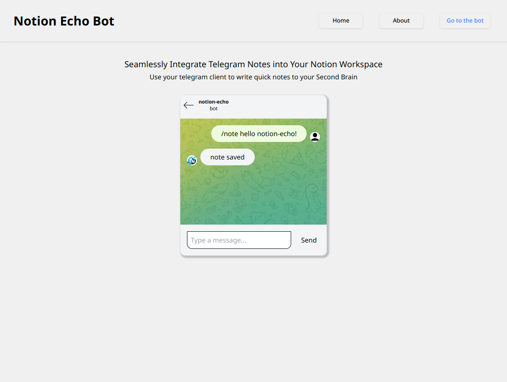
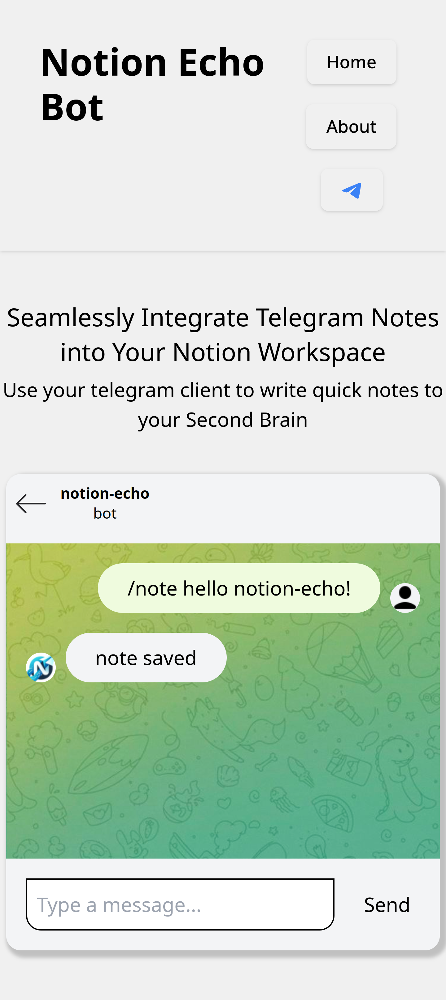

# Notion Echo Website Template

A template for presenting a telegram bot in a cool way with an integrated chat that can be modified to interact with a mock of your bot.

# Preview

To have a preview of the website: <a href="notion-echo.fulvio.dev">This is the URL</a>

### Desktop Preview

### Mobile Preview

